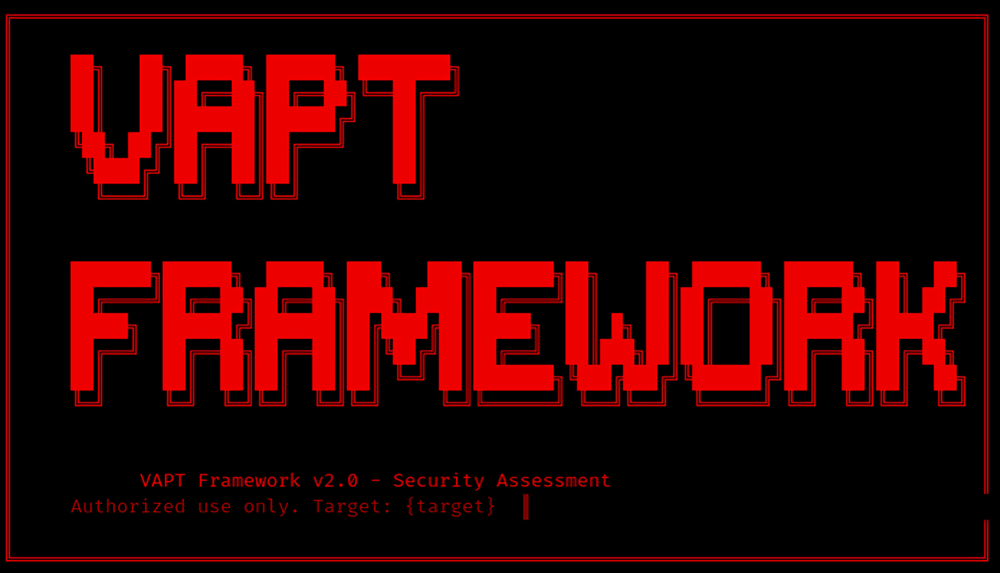

# 🔐 VAPT Framework

<p align="center">
  
</p>

<p align="center">


</p>

---

## 📖 Overview

**VAPT Framework** is a modular **Vulnerability Assessment and Penetration Testing (VAPT)** toolkit that automates multiple stages of an ethical hacking engagement. It combines reconnaissance, scanning, enumeration, vulnerability assessment, web application testing, password auditing, exploitation assistance, and reporting into a single command-line interface.

Designed for **Cyber Security Professionals, SOC Analysts, Ethical Hackers, Red Teams, Blue Teams, Purple Teams, Security Researchers, and Students**, the framework simplifies security assessments while following industry best practices.

---

# ✨ Features

- 🔎 Passive & Active Reconnaissance
- 🌐 Network Discovery
- 🚪 Port Scanning
- 🔍 Service Enumeration
- ⚠️ Vulnerability Assessment
- 🌍 Web Application Security Testing
- 📂 Directory & File Enumeration
- 🌐 Subdomain Discovery
- 🔑 Password Security Auditing
- 💥 Exploitation Assistance
- 📄 Automated Report Generation
- 📊 Scan Result Export
- 🧩 Modular Architecture
- ⚡ Easy Command Line Interface

---

# 🛠 Integrated Tools

| Tool | Purpose |
|------|----------|
| Nmap | Network Discovery & Port Scanning |
| RustScan | High-Speed Port Scanner |
| Masscan | Internet Scale Port Scanner |
| WhatWeb | Website Fingerprinting |
| Nikto | Web Server Vulnerability Scanner |
| Gobuster | Directory Enumeration |
| Dirsearch | Hidden File Discovery |
| ffuf | Web Fuzzing |
| Subfinder | Subdomain Enumeration |
| Amass | Asset Discovery |
| dnsrecon | DNS Enumeration |
| theHarvester | OSINT Information Gathering |
| SQLMap | SQL Injection Testing |
| XSStrike | XSS Detection |
| WPScan | WordPress Security Scanner |
| Hydra | Password Auditing |
| John the Ripper | Password Cracking |
| Hashcat | GPU Password Recovery |
| Metasploit | Exploitation Framework |
| Searchsploit | Exploit Database Search |
| Tcpdump | Packet Capture |
| Wireshark | Network Traffic Analysis |
| Netcat | Network Utility |
| CrackMapExec | Active Directory Assessment |
| Enum4linux | SMB Enumeration |
| Impacket | Network Protocol Toolkit |

---

# 📂 Project Structure

```
VAPT-Framework/
│
├── assets/
│   ├── banner.png
│   ├── logo.png
│
├── modules/
│   ├── reconnaissance.py
│   ├── scanner.py
│   ├── web.py
│   ├── password.py
│   ├── exploit.py
│   ├── reporting.py
│
├── reports/
│
├── requirements.txt
├── config.py
├── framework.py
├── README.md
└── LICENSE
```

---

# ⚙ Installation

## Clone Repository

```bash
git clone https://github.com/pal990452-star/VAPT-Framework.git

cd VAPT-Framework

cd Source

chmod +x vapt_framework.py

sudo python3 vapt_framework.py -u http://example.com 

```


## Create Virtual Environment

```bash
python3 -m venv venv
```

## Activate Environment

### Linux

```bash
source venv/bin/activate
```

### Windows

```bash
venv\Scripts\activate
```

## Install Dependencies

```bash
pip3 install requests beautifulsoup4
```

---

# 🚀 Usage

Run the framework

```bash
python framework.py
```

Example

```bash
python framework.py --target 192.168.1.1
```

or

```bash
python framework.py --url https://example.com
```

---

# 📸 Screenshots

## Example


<p align="center">
  
</p>


---

# 📊 Workflow

```
Target
   │
   ▼
Reconnaissance
   │
   ▼
Port Scanning
   │
   ▼
Enumeration
   │
   ▼
Vulnerability Assessment
   │
   ▼
Web Security Testing
   │
   ▼
Password Audit
   │
   ▼
Exploitation Assistance
   │
   ▼
Generate Report
```

---

# 🎯 Target Users

- Penetration Testers
- Ethical Hackers
- SOC Analysts
- Red Team
- Blue Team
- Purple Team
- Security Researchers
- Cyber Security Students

---

# 📌 Roadmap

- [x] Reconnaissance
- [x] Port Scanning
- [x] Enumeration
- [x] Vulnerability Assessment
- [x] Password Auditing
- [ ] CVE Lookup
- [ ] AI Vulnerability Suggestions
- [ ] HTML Reports
- [ ] PDF Reports
- [ ] Docker Support
- [ ] Web Dashboard
- [ ] Plugin Marketplace

---

# 🤝 Contributing

Contributions are welcome!

1. Fork the repository
2. Create your feature branch

```bash
git checkout -b feature-name
```

3. Commit changes

```bash
git commit -m "Added new feature"
```

4. Push changes

```bash
git push origin feature-name
```

5. Open a Pull Request

---

# 📜 License

This project is licensed under the **MIT License**.

---

# ⚠ Disclaimer

This framework is developed **strictly for educational purposes, authorized penetration testing, and security research**.

Never scan, attack, or exploit systems without explicit permission.

The developer is **not responsible** for any misuse of this project.

---

# 👨‍💻 Author

**Sayani Pal**

- 🎓 Advanced Networking & Cyber Security Student
- 🛡️ SOC Analyst
- 🔴 Red Team
- 🔵 Blue Team
- 🟣 Purple Team
- 💻 Offensive Security Enthusiast
  

GitHub: https://github.com/pal990452-star
LinkedIN: https://www.linkedin.com/in/sayani-pal-0ab44328b/


---

⭐ **If you find this project useful, don't forget to Star the repository!**
